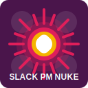
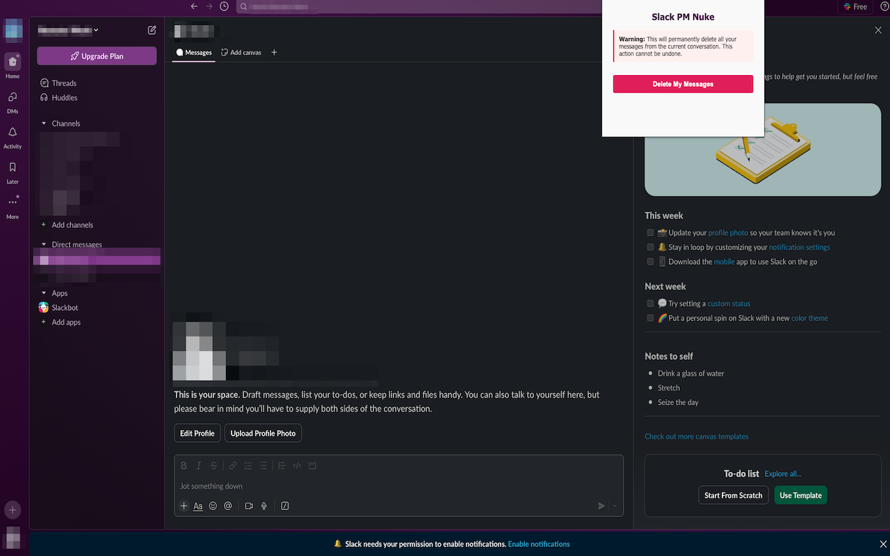

# Slack PM Nuke

<div align="center">
  
</div>

<div align="center">
  <a href="https://chromewebstore.google.com/detail/slack-pm-nuke/abfinnhkhaoabnflickhgaodmnkloaog">
    
  </a>
</div>

A Chrome extension that allows you to quickly and securely delete all your private messages from any Slack conversation with a single click.

## Screenshot

<div align="center">
  
</div>

## Features

- Delete all your messages from the current Slack conversation
- Simple one-click operation
- Works with direct messages, group chats, and channels

## Installation

### From Chrome Web Store (Recommended)

1. Visit the Chrome [Web Store page for Slack PM Nuke](https://chromewebstore.google.com/detail/slack-pm-nuke/abfinnhkhaoabnflickhgaodmnkloaog)
2. Click "Add to Chrome"
3. Confirm the installation

### Manual Installation

1. Download or clone this repository
2. Open Chrome and navigate to `chrome://extensions/`
3. Enable "Developer mode" in the top-right corner
4. Click "Load unpacked" and select the `dist` folder containing the extension files
5. The extension should now appear in your Chrome toolbar

## Usage

1. Log in to your Slack workspace in Chrome
2. Navigate to the Slack conversation you want to clean up
3. Click the Slack PM Nuke icon in your Chrome toolbar
4. Confirm that you want to delete all your messages from the current conversation
5. Wait for the process to complete (this may take some time depending on the number of messages)

## Project Structure

- `chrome-store/`: Contains assets for Chrome Web Store listing (screenshots, descriptions)
- `dist/`: Contains the final extension code ready for distribution
- `scripts/`: Utility scripts, including SVG to PNG conversion for icons
- `src/icons/`: Source SVG files for extension icons

## Development

### Prerequisites

#### Installing librsvg

The `rsvg-convert` command is required for icon generation. Install it using:

```bash
# MacOS
brew install librsvg
```

### Setup

1. Clone the repository
2. Install dependencies:
   ```bash
   npm install
   ```

### Build Scripts

The project includes two main build scripts:

1. Generate PNG icons from SVG:

   ```bash
   npm run build-icons
   ```

   This converts the SVG icons to PNG in different sizes (16x16, 48x48, 128x128)

The build scripts are located in the `scripts` directory and include error handling and dependency checks.

## Privacy & Security

- Slack PM Nuke operates entirely within your browser
- No data is sent to external servers
- Your Slack credentials and tokens remain secure in your browser
- The extension only accesses the specific conversation you're currently viewing

## Limitations

- The extension can only delete messages that you have permission to delete (your own messages)
- Some workspaces may have retention policies that prevent message deletion
- The extension requires a stable internet connection during the deletion process

## Troubleshooting

If you encounter issues:

1. Make sure you're logged into Slack in the same browser
2. Refresh the Slack page and try again
3. Ensure you have a stable internet connection
4. If problems persist, try reinstalling the extension

## License

MIT License

## Disclaimer

This extension is not affiliated with, endorsed by, or connected to Slack Technologies, Inc. in any way. Use at your own risk.

## Support

For issues, feature requests, or questions, please open an issue on the GitHub repository.

## Author

Created by [davidgg.es](https://davidgg.es)
